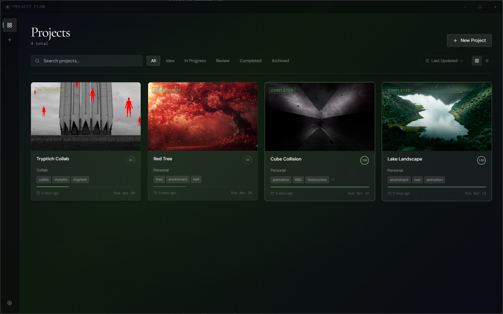

<div align="center">


# Project Flow

**A minimal, elegant desktop app for VFX artists to organize projects — visually, simply, and without noise.**

[](https://github.com/adriangarcia/projectflow/releases)
[](LICENSE)
[](https://www.electronjs.org/)
[](https://react.dev/)

*Created by [Adrián García](https://github.com/adriangarcia), 3D Artist*

</div>

---

> ⚠️ **Beta software.** Project Flow is actively developed and not yet feature-complete. Expect rough edges. Data persistence is stable, but always keep backups via **Settings → Export Backup**.

---

## What is it?

Project Flow is a **local desktop application** built for VFX artists who work across tools like Houdini, Nuke, Blender, or any DCC pipeline. It gives you one calm, visual place to track your projects — renders, previews, reference boards, pipeline stages, notes — without depending on cloud services, subscriptions, or complex setup.

Everything runs locally. No account needed. No internet required.

---

<p align="center">
  
  <br />
  <em>Main project view inside Project Flow</em>
</p>

## Features

| | Feature | Description |
|---|---|---|
| 🗂 | **Visual project gallery** | Grid and list views with 3D hover cards |
| 🔵 | **Pipeline map** | Animated node tree to track production stages — drag to reorder, mark complete |
| 🎞 | **Renders & Previews** | Drag-and-drop media import, lightbox viewer, version labels |
| 🖼 | **References board** | Images, videos, links, notes — tag filtering and moodboard layout |
| 📝 | **Markdown notes** | Live preview editor with autosave |
| 📁 | **Folder integration** | Attach a project folder, open it in Explorer/Finder, auto-create structure |
| 💾 | **Local-first** | All data stored locally — export/import as JSON |

---

## Screenshots

> _Screenshots coming soon. The UI is dark, minimal, and editorial in feel._

---

## Tech Stack

| Layer | Technology |
|---|---|
| Desktop shell | Electron 33 |
| UI | React 18 + TypeScript |
| Build | Vite 6 |
| Styling | Tailwind CSS 3 + CSS variables |
| State | Zustand |
| Animations | Framer Motion |
| Icons | Lucide React |
| Fonts | Cormorant Garamond · DM Sans · DM Mono |
| Persistence | localStorage (no external DB) |
| Packaging | electron-builder |

---

## Requirements

- **Node.js 18+** — [nodejs.org](https://nodejs.org)
- **npm 9+** (included with Node)
- **FFmpeg** — required for video thumbnails and media processing (see below)
- Windows 10/11 x64, macOS 12+, or Linux (tested primarily on Windows)

---

## FFmpeg Setup

FFmpeg is required for generating video thumbnails and handling certain media formats.

### Windows

1. Download from [ffmpeg.org/download.html](https://ffmpeg.org/download.html) — get the "essentials" or "full" Windows build
2. Extract and copy `ffmpeg.exe` to a folder, e.g. `C:\ffmpeg\bin\`
3. Add that folder to your system `PATH`:
   - Open **System Properties → Advanced → Environment Variables**
   - Under **System variables**, find `Path` → Edit → New → `C:\ffmpeg\bin`
4. Open a new terminal and verify: `ffmpeg -version`

### macOS

```bash
brew install ffmpeg
```

### Linux

```bash
sudo apt install ffmpeg       # Ubuntu / Debian
sudo dnf install ffmpeg       # Fedora
sudo pacman -S ffmpeg         # Arch
```

> **Without FFmpeg:** The app still runs. Images, notes, pipeline, and project management all work normally. Only video thumbnail generation and proxy transcoding are affected.

---

## Installation

```bash
git clone https://github.com/adriangarcia/projectflow.git
cd projectflow
npm install
```

---

## Running in Development

```bash
npm run dev
```

Starts Vite on `http://localhost:5173` and launches Electron. Hot reload is active — changes to `src/` reflect instantly.

> **Windows note:** If you experience permission errors or media import failures, try running your terminal **as Administrator**. Right-click your terminal icon → "Run as administrator".

---

## Building for Production

### Windows installer
```bash
npm run dist:win
# Output: release/Project Flow Setup 1.0.0-beta.1.exe
```

### macOS
```bash
npm run dist:mac
```

### Linux
```bash
npm run dist:linux
```

Before building, place icon files in `resources/`:

| File | Format | Platform |
|---|---|---|
| `icon.ico` | 256×256 | Windows |
| `icon.icns` | 512×512 | macOS |
| `icon.png` | 512×512 | Linux |

---

## How to Use

1. **Create a project** — Click "New Project", add a name and optional details
2. **Set up your pipeline** — Define and reorder production stages in the Overview tab
3. **Import media** — Drag renders, WIP frames, or reference images into each section
4. **Track progress** — Mark nodes complete; a progress arc updates on the project card
5. **Write notes** — Use the Notes tab for Markdown production notes
6. **Back up your data** — Settings → Export Backup saves a `.json` snapshot

To move to another machine: export from Settings → import on the new device.

---

## Project Structure

```
projectflow/
├── electron/
│   ├── main.js          Main process — window, IPC handlers, pf:// streaming protocol
│   └── preload.js       Context bridge — exposes electronAPI to renderer
│
├── src/
│   ├── components/
│   │   ├── layout/      AppShell, Titlebar
│   │   ├── pipeline/    PipelineMap (the animated node tree)
│   │   ├── project/     RendersSection, PreviewsSection, ReferencesSection,
│   │   │                NotesSection, ProjectOverview, ProjectCard, etc.
│   │   └── ui/          Button, Modal, MediaLightbox, Toast, TagInput, etc.
│   ├── pages/           HomePage, NewProjectPage, ProjectDetailPage, SettingsPage
│   ├── store/           Zustand stores (projects, settings, theme)
│   ├── db/              localStorage persistence layer
│   ├── hooks/           useMouseParallax, useDebounce, useKeyPress
│   ├── types/           TypeScript interfaces
│   ├── utils/           mediaPersistence, videoPoster, videoProxy, exrParser
│   └── styles/          globals.css — design tokens + Tailwind base
│
├── public/
│   └── favicon.svg
├── resources/           Icon files for packaging (generate before building)
├── index.html
├── package.json
├── vite.config.ts
└── tailwind.config.js
```

---

## Known Limitations / Beta Notes

- **Video playback** uses a custom `pf://` streaming protocol with Range request support. H.264 MP4 works natively in Electron. ProRes `.mov` and HEVC require FFmpeg to transcode to a playable format.
- **Windows drag-and-drop** from some system locations (desktop shortcuts, network shares, recent files) may produce relative paths. The app handles this, but if an import fails, try the file picker instead of dragging.
- **Packaging icons** (`icon.ico`, `icon.icns`, `icon.png`) are not included in the repository. You need to generate them before running a production build.
- **Data storage** uses localStorage for metadata and references. Imported media files are copied to the Electron `userData` folder (`AppData/Roaming/projectflow/media/` on Windows) for stable persistence.
- **This is a beta release.** Core features are working but some edge cases are not yet handled. Always keep a backup export.

---

## Troubleshooting

**Blank screen on startup**
Run `npm install` first. If that doesn't help, delete `node_modules/` and reinstall.

**Videos show "Preview unavailable"**
Install FFmpeg and ensure it's on your system PATH. On Windows, try running as Administrator.

**Media import fails**
On Windows, right-click your terminal → "Run as administrator". Also try the file picker instead of drag-and-drop for files on network drives or in compressed folders.

**Build fails**
Make sure `icon.ico` / `icon.icns` / `icon.png` exist in `resources/` before running `npm run dist`.

**Check the DevTools console** (Ctrl+Shift+I in the running app) for detailed error messages.

---

## Roadmap

- [ ] Light / system theme support
- [ ] Timeline / Gantt view per project
- [ ] Project templates
- [ ] Export project as PDF report
- [ ] Multi-window support
- [ ] ZIP archive export
- [ ] Configurable media storage location

---

## Contributing

Contributions are welcome. Please keep things practical — this is an indie tool.

1. Fork the repo
2. Create a branch: `git checkout -b feature/your-idea`
3. Test your changes with `npm run dev`
4. Open a pull request with a clear description

See [CONTRIBUTING.md](CONTRIBUTING.md) for details. Report bugs and ideas via [GitHub Issues](https://github.com/adriangarcia/projectflow/issues).

---

## License

[MIT](LICENSE) — free to use, modify, and distribute.

---

<div align="center">

*Made for VFX artists. No noise, no clutter.*

*Created by [Adrián García](https://github.com/adriangarcia), 3D Artist*

</div>
